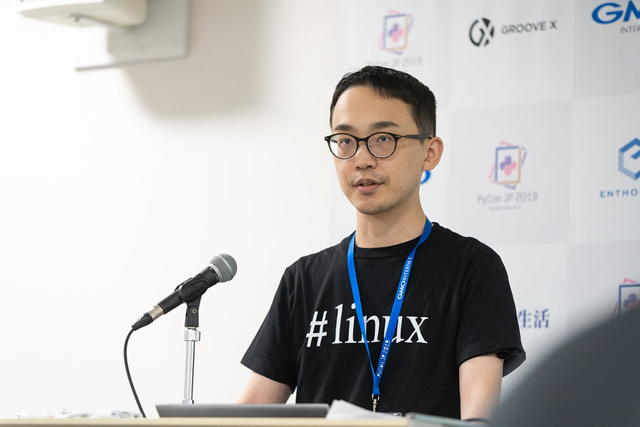

# PyCon JPとは

@ksugaharaが書きます

# 1日目基調講演

@ussy

### 資料リンク

* [動画]()
* [スライド]()

# トークセッション（1）

@ussy

### 資料リンク

* [動画]()
* [スライド]()

# トークセッション（2）

@ussy

### 資料リンク

* [動画]()
* [スライド]()

# Introduction to FEM Analysis with Python

(@HiraoMotoki)

Tetsuo Koyama氏による「Introduction to FEM Analysis with Python」の発表です。発表は英語で行われました。
FEM（finite element method、有限要素法）はPED（partial differential equations、偏微分方程式）を解くために用いられます。GetFEM++はPDEをFEMで解くためのフレームワークを提供しています。Qhull、MUMPS、LAPACK/BLAS、Numpy/Scipyなど、数値計算に必要なライブラリも合わせて必要なようです。

コードと一緒にオブジェクトを扱う例を紹介していました。Mesher Object、Mesh Object、MeshFem Object、Model Objectと、それらに関連するいくつかのメソッドが紹介されました。
最後にLaplacian Brick, RHS and conditionを用いて数式を解き、グラフィカルな表示と検算を行うことの解説をされていました。

質問もいくつか出ており、この技術の応用例、その他の解析手法の利用、3Dモデルへの利用、解析を行うPCのスペックについて回答していました。

### 資料リンク

* [動画](https://www.youtube.com/watch?v=6JuB1GiDLQQ)
* [スライド](https://gitpitch.com/tkoyama010/OpenCAE-tkoyama010/PyConJP2019#/)

# トークセッション（4）

@nikkie

### 資料リンク

* [動画]()
* [スライド]()

# 1日目ライトニングトーク

説明 @ksugahara

## 1つ目タイトル

@ussy

## 2つ目タイトル

@nikkie

## 1日目ライトニングトーク一覧

@ussy

今回ご紹介しきれなかったものも含め、1日目のライトニングトークの一覧はこちらです。また、Pythonの公式アカウントに[ライトニングトークの動画]()がアップロードされています。

# 次回は

@nikkie

1日目のカンファレンスレポートは以上です。今回紹介できなかったセッションも多数あるのですが、それらは下記のリンクから見ることができます。みなさまの気になるセッションやトークは見つかりましたか？

* [Youtube PyCon JP公式アカウント](https://www.youtube.com/channel/UCxNoKygeZIE1AwZ_NdUCkhQ)

2日目のレポートも後日、公開しますので楽しみにしてください！
