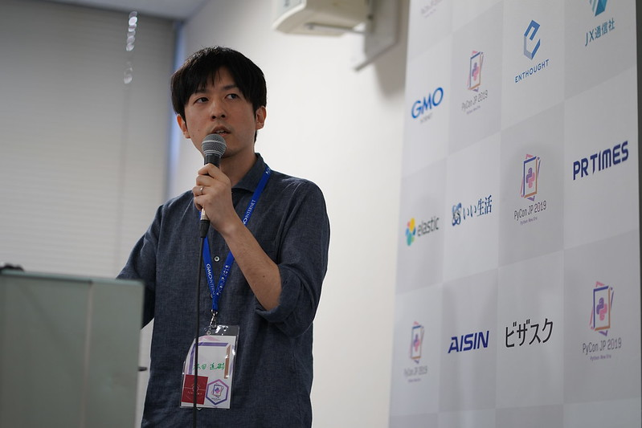

導入
@ksugahara

# 2日目基調講演

@nikkie

### 資料リンク

* [動画]()
* [スライド]()

# トークセッション（1）

@nikkie

### 資料リンク

* [動画]()
* [スライド]()

# トークセッション（2）

@nao_y

### 資料リンク

* [動画]()
* [スライド]()

# 2日目注目セッション「新米Pythonistaが贈るAirflow入門 & 活用事例紹介」ー松田直樹

（平尾 元紀）

松田直樹氏による「新米Pythonistaが贈るAirflow入門 & 活用事例紹介」の発表です。
Airflowとは元Airbnb製のPythonで作られたオープンソースで、バッチ処理からなるワークフローのスケジューリング＆モニタリングが可能なプラットフォームです。現在はApacheソフトウェア財団が管理、開発を活発に行なっています。
AirflowではPythonコードでワークフローをDAG（Directed acyclic graph, 有向非巡回グラフとも）表現します。
これによりワークフローを構成するタスクを作成し、処理を実行していきます。

発表では、社内での活用事例を取り上げていました。社内向けのデジタル広告プランニングツールを開発するプロダクトに携わっているそうですが、その中の課題としてデータがRDBに入っていないものがあり必要なデータをたどるのが大変であるという課題がありました。そこで、データマートを作成することで、開発プロダクト用に必要なデータを作成する方法についてお話されていました。
AWS Fargateを使い、その内部でAirflowを使ってカラム名を寄せるなどの処理を実現し、活用可能なデータの取り出しを実現していました。
実現する上でハマったポイントの共有もありました。タスク間のデータのやり取りと、Dockerを用いたローカル開発環境の構築についてお話されていました。

エンジニア業務に入って9月で1年とのことでしたが、AirflowとAWSのサービスを組み合わせ、開発をより円滑にするための業務改善に生かしている点が素晴らしいと思いました。

### 資料リンク

* [動画](https://www.youtube.com/watch?v=T0JVQWfnRAo)
* [スライド](https://speakerdeck.com/matsudan/pycon-jp-2019-xin-mi-pythonistagazeng-ruairflowru-men-and-huo-yong-shi-li-shao-jie)

# 2日目注目セッション「Ansibleを通じて「べき等性」を理解してみよう」ーKazuya Takei

（平尾 元紀）

Kazuya Takei氏による「Ansibleを通じて「べき等性」を理解してみよう」の発表です。
冪等性とはざっくりいうとある操作を何度実行しても、同じ結果になる性質を持つことを意味します。
AnsibleはPython製の構成管理ツールで、主にサーバーのセットアップなどに用いられます。Ansibleでは「動作」でなく「状態」を定義して使用する特徴があります。この理由を設定ファイル内のPlaybookを見ながら説明をなされていました。
同じPlaybookを実行しても2回目以降は状態に変化がないことから、ある操作を何度実行しても同じ結果になるので、
Ansibleは定義された「状態に対する冪等性」を担保されるようになっています。

発表の後半では実際のAnsibleのコードを読みながら、Ansibleが実現している冪等性についてお話されていました。
pip コマンド経由で、Pythonパッケージの状態を管理するpipモジュールを例として取り上げていました。
コードの内部では、求める状態に応じて、地道にコマンドを生成していました。実行結果（リターンコード、標準出力、標準エラー）を見ながら、状態に変化があったかどうかを判定していました。

Ansibleが実現している冪等性について理解するとともに、発表で取り上げられていたコード断片を見ていると、Ansibleの内部ではリターンコードの値を見ながら処理したりしていて、人気のあるライブラリも中では地道に作られているのだなということを知る良い機会となりました。

### 資料リンク

* [動画](https://www.youtube.com/watch?v=Em1xC5bIGl0)
* [スライド](https://attakei.net/slides/pyconjp-2019/index.html)

# 2日目ライトニングトーク

説明 @ksugahara

## 1つ目タイトル

@nikkie

## 2つ目タイトル

@nao_y

## 2日目ライトニングトーク一覧

@nikkie

今回ご紹介しきれなかったものも含め、2日目のライトニングトークの一覧はこちらです。また、Pythonの公式アカウントに[ライトニングトークの動画]()がアップロードされています。

# クロージング

（平尾 元紀）

まず座長の吉田さんから今年の来場者数の発表がありました。9/14のスプリントには103名、9/15のチュートリアルには106名、9/16, 17のカンファレンスには951名が参加し、トータルで1160名の参加者となり、今年も1000人を超える大きなイベントとなりました。

続いて、一般社団法人 PyCon JPからの報告がありました。
最初に、商標権のお話がありました。「Python」を商標登録している会社に対し、米Pythonソフトウエア財団（PSF）として行動するとのことでした。

次に、2019年は4つのPythonカンファレンスと10回のPython Boot Campに支援したという報告がありました。また新しい試みとしてOSCにPython Caravanとして参加することや、PyLadies、Python Boot Campの参加者に援助も始めたとのことです。
PyCon JPでも金銭的なサポートや運営の相談に乗ってもらっており、一般社団法人 PyCon JPはコミュニティを支える、なくてはならない存在となっています。

セッションの裏側ではコミュニティーのミートアップも行われ、盛況だったとのことです。東京のPyCon JPだけではなく、ぜひタイミングがありましたら地方のPyConにも参加してみてください。

最後に、来年のPyCon JPの日程が8/28(金), 8/29(土)と発表されました。場所は2019年と一緒の大田区産業プラザPioです。座長はまだ未定です。クロージングでは3年間座長を務めた吉田さんへ花束が贈呈されました。
来年のPyCon JPも楽しみですね。

